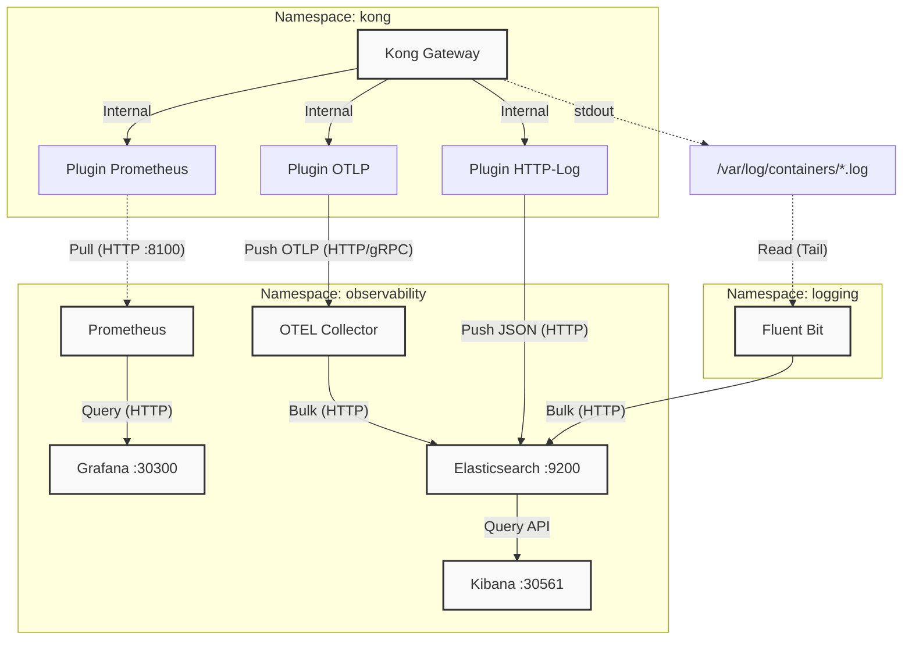

# Kong Konnect POC - Observability Stack 🚀

## 🎯 Objectif
POC démontrant une stack d'observabilité complète pour Kong Gateway sur Kubernetes, incluant :
1.  **Logs API "Elite"** : Capture complète des headers, `request.body` et `response.body`.
2.  **Dashboard Kibana avancé** : Visualisations interactives et filtres.
3.  **Traçabilité** : OpenTelemetry et métriques Prometheus.

---

### Architecture Observability

Le projet utilise une architecture cloisonnée par Namespaces :



---

## 💻 Setup from Scratch (Mac/Local)

Guide pour reproduire ce projet sur une machine locale (Mac Silicon/Intel) avec Docker Desktop.

### Pré-requis
- **Docker Desktop** (avec Kubernetes activé dans les settings)
- **kubectl** (`brew install kubectl`)
- **deck** (`brew install kong/deck/deck`)
- **curl**, **jq** (`brew install jq`)

### 1. Installation de l'Infra (Kong + Nginx + Echo)

Utilisez le script de déploiement automatique qui configure les namespaces, installe Kong via Helm et déploie Nginx.

```bash
# 1. Cloner le repo
git clone <votre-repo>
cd nginx-kub-konnect

# 2. Déployer l'infrastructure
./scripts/deploy-infra.sh

# 3. Déployer la stack Observability
kubectl apply -f k8s/observability/

# 4. Initialiser Elasticsearch et Kibana (IMPORTANT!)
# Ce script crée les index avec le bon mapping pour éviter les erreurs VALUE_NULL
./scripts/setup-elasticsearch-kibana.sh

# 5. Attendre que les pods soient "Running"
kubectl get pods -A
```

> **Note importante** : Le script `setup-elasticsearch-kibana.sh` doit être exécuté **après** le déploiement de la stack observability pour créer les index Elasticsearch avec le bon mapping et configurer les index patterns Kibana. Cela évite les erreurs "VALUE_NULL" dans Kibana.

### 2. Configuration Kong Gateway

```bash
# Appliquer la config Kong (Plugins, Services, Routes)
deck gateway sync deck/kong.yaml --select-tag=poc-observability

# Note: Port-forward du Admin API nécessaire si deck tourne en local
kubectl port-forward svc/kong-dp-kong-admin -n kong 8001:8001 &
export KONG_ADDR="http://localhost:8001"
```

### 3. Initialisation Kibana (Data Views uniquement)

Nous utilisons un script pour configurer les vues de données automatiquement.

```bash
# Créer les Data Views (API Logs, System Logs, Traces)
./scripts/setup-kibana-views.sh
```

### 4. Vérification

Lancez le script de check complet :

```bash
./scripts/check-observability.sh
```

---

## 📊 Accès aux Dashboards

| Service        | URL Local                                        | Login             | Description              |
| -------------- | ------------------------------------------------ | ----------------- | ------------------------ |
| **Kibana**     | [http://localhost:30561](http://localhost:30561) | -                 | Logs & Traces (Discover) |
| **Grafana**    | [http://localhost:30300](http://localhost:30300) | `admin` / `admin` | Métriques & Performance  |
| **Prometheus** | [http://localhost:30090](http://localhost:30090) | -                 | Explorateur Métriques    |

---

## 📁 Structure du Projet

```text
├── k8s/
│   └── observability/   # Manifestes K8s (Elastic, Kibana, FluentBit...)
├── deck/
│   └── kong.yaml        # Config Kong (Plugins, Lua Custom Injection)
├── scripts/
│   ├── check-observability.sh    # Healthcheck global
│   └── setup-kibana-views.sh     # Setup Data Views
└── README.md
```
